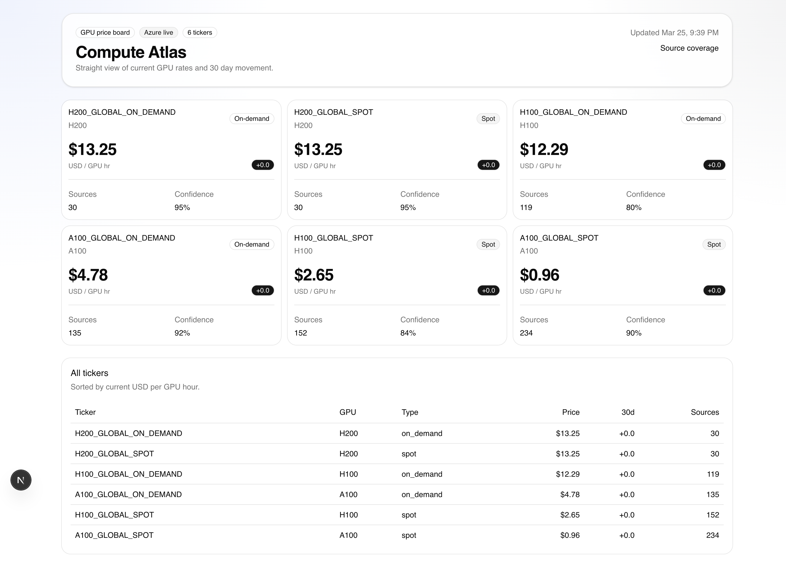

# Compute Atlas

Open-source GPU price aggregation for comparing live cloud and marketplace
rates with explicit source coverage and normalization logic.

[GitHub repository](https://github.com/SebastianBoehler/compute_atlas)

## Why this exists

GPU pricing is fragmented across cloud vendors and specialized marketplaces.
Compute Atlas exists to make the aggregation and normalization path inspectable
in public:

- provider inputs are modular and traceable
- methodology is explicit and versioned
- normalized time-series data is queryable
- source gaps remain visible instead of being hand-waved away

This repository is intended to be the auditable core of a practical GPU price
tracker. Paid products, if added later, should be service layers on top of the
same open codebase rather than a closed replacement for it.

## Preview



## License

This repository is licensed under Apache-2.0. That keeps the core open and
verifiable while still allowing commercial hosted products, support, and other
paid service layers to be offered later.

## Architecture

- `apps/web`: Next.js App Router dashboard plus public API
- `apps/worker`: ingestion, normalization, and optional downstream jobs
- `packages/db`: schema, migrations, seed data, and query helpers
- `packages/provider-sdk`: shared adapter interfaces and registry
- `packages/providers`: live provider implementations
- `packages/methodology`: normalization and index calculation
- `packages/publisher-solana`: optional Solana devnet publisher kept separate
- `packages/api-contract`: typed response schemas and OpenAPI helpers

## Open-source model

The repository is open source first.

Open and auditable:

- methodology logic
- provider adapter interfaces
- public API contracts
- dashboard transparency views

Possible paid layers later:

- managed hosted dashboard
- alerting and notifications
- higher-availability endpoints
- premium historical analytics
- team and access-control features

## Provider source reality

As of March 25, 2026, provider coverage is mixed:

- strong official API paths: AWS, Azure, GCP
- usable authenticated/API-like paths: Runpod, Vast.ai
- public-page ingestion candidates: CoreWeave, Lambda
- weaker first-wave automation candidates: OCI and quote-driven vendors

That means the project works well as a live GPU price aggregator, but it should
not pretend every major provider exposes equally clean machine-readable price
feeds from day one.

Current implementation status:

- live now: Azure retail prices API
- next straightforward additions: GCP Billing Catalog API, Runpod API, Vast.ai API
- later/manual-ingestion tier: AWS spot/on-demand blending, CoreWeave, Lambda, OCI

See [docs/OPEN_SOURCE_MODEL.md](/Users/sebastianboehler/Documents/GitHub/compute_atlas/docs/OPEN_SOURCE_MODEL.md) and [GOVERNANCE.md](/Users/sebastianboehler/Documents/GitHub/compute_atlas/GOVERNANCE.md).

## Quick start

```bash
cd /Users/sebastianboehler/Documents/GitHub/compute_atlas
nvm install 22
nvm use 22
corepack enable
cp .env.example .env
docker compose -f infra/docker/docker-compose.yml up -d db
pnpm install
pnpm db:migrate
pnpm db:seed
pnpm dev
```

To ingest the first live provider and populate real observations:

```bash
ENABLE_PUBLICATIONS=false pnpm worker:pipeline
```

For a containerized web-only preview that matches the production service shape:

```bash
docker compose -f infra/docker/docker-compose.yml up --build web
```

For the full containerized stack with Postgres and worker:

```bash
docker compose -f infra/docker/docker-compose.yml --profile full up --build
```

## Useful commands

```bash
pnpm lint
pnpm typecheck
pnpm test
pnpm build
pnpm db:migrate
pnpm db:seed
pnpm solana:keypair:create
pnpm publish:devnet
pnpm verify:devnet
pnpm verify:e2e
```

## Environment variables

- `DATABASE_URL`: Postgres connection string.
- `TIMESCALE_ENABLED`: Enables Timescale-specific migration steps when the extension exists.
- `ENABLE_PUBLICATIONS`: Enables downstream publication jobs when explicitly needed.
- `SOLANA_RPC_URL`: Solana devnet RPC endpoint.
- `SOLANA_RPC_WS_URL`: Solana websocket endpoint.
- `SOLANA_KEYPAIR_PATH`: Relative path from the repo root for the publisher keypair.
- `SOLANA_AIRDROP_MIN_BALANCE_SOL`: Auto-airdrop threshold used by verification.
- `SOLANA_AIRDROP_TARGET_BALANCE_SOL`: Desired balance after airdrop.
- `GCP_BILLING_API_KEY`: Optional API key for the next provider tier.
- `RUNPOD_API_KEY`: Optional API key for later Runpod ingestion.
- `VAST_API_KEY`: Optional API key for later Vast.ai ingestion.
- `ENABLE_ADMIN_UI`: Enables the admin page.
- `NEXT_PUBLIC_REPOSITORY_URL`: Repository link shown in the UI.

## Local services

- Web/API: `http://localhost:3000`
- Postgres: `localhost:55432`

## Cloud Run split

- `compute-atlas-web`: public web and API service
- `compute-atlas-worker`: request-driven pipeline job

Deploy assets live in [infra/cloudrun](/Users/sebastianboehler/Documents/GitHub/compute_atlas/infra/cloudrun).

## Community files

- [CONTRIBUTING.md](/Users/sebastianboehler/Documents/GitHub/compute_atlas/CONTRIBUTING.md)
- [CODE_OF_CONDUCT.md](/Users/sebastianboehler/Documents/GitHub/compute_atlas/CODE_OF_CONDUCT.md)
- [SECURITY.md](/Users/sebastianboehler/Documents/GitHub/compute_atlas/SECURITY.md)
- [GOVERNANCE.md](/Users/sebastianboehler/Documents/GitHub/compute_atlas/GOVERNANCE.md)
- [docs/ROADMAP.md](/Users/sebastianboehler/Documents/GitHub/compute_atlas/docs/ROADMAP.md)

## Current limitations

- Azure live retail pricing is implemented first; the other providers are still
  staged behind future adapters.
- Some large providers expose public APIs, while others will need authenticated
  APIs or pricing-page ingestion before they can join the board.
- In-memory rate limiting and caching are suitable for single-instance
  deployments, not scaled multi-instance production.
